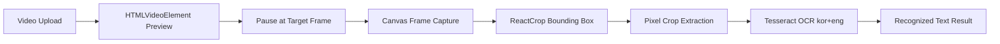

# TypeScript Video OCR

동영상 프레임에서 사용자가 직접 텍스트 영역을 지정하고 OCR 결과를 추출하는 Electron + React 애플리케이션입니다. 로컬 동영상 업로드, 프레임 캡처, 바운딩 박스 선택, 크롭 이미지 추출, 클라이언트 사이드 OCR까지 이어지는 전체 흐름을 구현합니다.

## 개요

이 프로젝트는 동영상 프레임에서 필요한 텍스트 영역만 선택적으로 읽어내는 로컬 우선 워크플로우를 다룹니다. 동영상 파일은 사용자의 환경에 남아 있고, OCR도 서버 업로드 없이 데스크톱/브라우저 런타임에서 실행됩니다. 사용자가 직접 프레임과 인식 영역을 선택하기 때문에, 영상 일부에만 텍스트가 있는 경우에도 필요한 영역만 대상으로 처리할 수 있습니다.

## 핵심 기능

- 동영상 파일 업로드 및 로컬 object URL 기반 재생
- 현재 재생 프레임을 HTML Canvas로 PNG 캡처
- `react-image-crop`을 이용한 OCR 대상 영역 지정
- 퍼센트 기반 crop 좌표를 실제 이미지 픽셀 좌표로 변환
- `tesseract.js` 기반 한국어 + 영어 OCR 처리
- OCR 진행률, 오류 메시지, 결과 텍스트 표시
- Electron 창 실행과 브라우저 실행 모드 분리
- 개발 포트 충돌 시 기존 프로세스를 종료하고 동일 포트로 재실행

## 기술 스택

| 영역 | 기술 |
| --- | --- |
| Desktop runtime | Electron |
| Frontend | React, TypeScript |
| Build tool | Vite |
| OCR engine | tesseract.js |
| Crop UI | react-image-crop |
| Icon system | lucide-react |
| Rendering APIs | HTMLVideoElement, Canvas API |

## 시스템 흐름



## 아키텍처 개요

```text
Electron Desktop Window
  -> Vite Dev Server
    -> React App
      -> Video Upload
      -> Frame Capture
      -> Crop Selection
      -> OCR Processing
```

현재 프로젝트는 백엔드 서버 없이 클라이언트 런타임에서 OCR을 수행합니다. Electron은 앱 창을 제공하고, 실제 UI와 OCR 로직은 React 애플리케이션에서 처리합니다.

## 주요 구현 포인트

### 1. 프레임 캡처

`HTMLVideoElement`의 현재 화면을 Canvas에 그린 뒤 PNG data URL로 변환합니다. 이 방식은 사용자가 영상에서 원하는 시점을 직접 탐색하고, 멈춘 장면만 OCR 대상으로 전환할 수 있게 합니다.

관련 코드: `src/App.tsx`의 `captureFrame`

### 2. 바운딩 박스 기반 OCR 영역 선택

캡처된 프레임을 이미지로 렌더링하고 `react-image-crop`으로 선택 영역을 지정합니다. UI에서의 crop 값은 화면 표시 크기 기준이므로, OCR 입력 이미지를 만들 때 원본 이미지의 `naturalWidth`, `naturalHeight` 기준으로 다시 스케일링합니다.

관련 코드: `src/App.tsx`의 `getCroppedImage`

### 3. 클라이언트 사이드 OCR

`tesseract.js`를 사용해 브라우저/Electron 렌더러 환경에서 OCR을 실행합니다. 현재 언어 설정은 `kor+eng`이며, 한국어와 영어가 섞인 영상 텍스트를 처리합니다.

관련 코드: `src/App.tsx`의 `runOCR`

### 4. Electron 실행 래퍼

`npm run dev`는 Vite 서버를 먼저 실행하고, 서버가 준비되면 Electron 창을 열어 앱을 표시합니다. 포트가 이미 사용 중이면 기존 프로세스를 종료한 뒤 같은 포트로 재실행합니다.

관련 코드:

- `scripts/desktop.mjs`
- `scripts/dev.mjs`
- `electron/main.cjs`

## 실행 방법

```bash
npm install
npm run dev
```

기본 실행은 Electron 데스크톱 창으로 열립니다. 내부적으로 Vite 개발 서버가 함께 실행되며 기본 주소는 다음과 같습니다.

```text
http://127.0.0.1:3000/
```

다른 포트를 사용하려면 다음처럼 실행합니다.

```bash
npm run dev -- --port 4000
```

## 실행 스크립트

| 명령어 | 설명 |
| --- | --- |
| `npm run dev` | Vite 서버 실행 후 Electron 데스크톱 앱 창 열기 |
| `npm run desktop` | `npm run dev`와 동일 |
| `npm run web` | 브라우저에서 React 앱 실행 |
| `npm run web:no-open` | 브라우저 자동 열기 없이 웹 서버만 실행 |
| `npm run build` | TypeScript 검사 후 Vite 프로덕션 빌드 |
| `npm run preview` | 빌드 결과 미리보기 |

## 프로젝트 구조

```text
.
├── electron/
│   └── main.cjs          # Electron BrowserWindow 진입점
├── scripts/
│   ├── desktop.mjs       # Vite 준비 후 Electron 실행
│   └── dev.mjs           # 포트 정리 후 Vite 실행
├── src/
│   ├── App.tsx           # 영상 OCR 워크플로우 핵심 로직
│   ├── App.css           # 앱 화면 스타일
│   ├── index.css         # 전역 스타일
│   └── main.tsx          # React 렌더링 진입점
├── index.html
├── vite.config.ts
└── package.json
```

## 빌드 확인

```bash
npm run build
```

빌드 결과는 `dist/`에 생성됩니다. 웹 배포만 필요한 경우 Vercel, Netlify, GitHub Pages 등에서 output directory를 `dist`로 지정할 수 있습니다.
