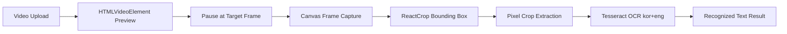

# TypeScript Video OCR

[한국어 README 보기](./README.ko.md)

An Electron + React application for extracting OCR text from a user-selected region of a video frame. The app covers the full interaction flow: local video upload, frame capture, bounding-box selection, cropped image extraction, and client-side OCR.

## Overview

This project implements a local-first workflow for reading text from video frames. The video file stays on the user's machine, and OCR runs in the desktop/browser runtime instead of requiring a server upload. The user controls the exact frame and region used for recognition, which is useful when only a small part of the video contains relevant text.

## Core Features

- Local video file upload and playback through an object URL
- Current-frame capture from `HTMLVideoElement` to PNG via Canvas
- OCR target region selection with `react-image-crop`
- Percent-based crop conversion into real source-image pixel coordinates
- Korean + English OCR using `tesseract.js`
- OCR progress, error state, and recognized text display
- Separate Electron desktop mode and browser web mode
- Development port cleanup before launching the app on the requested port

## Tech Stack

| Area | Technology |
| --- | --- |
| Desktop runtime | Electron |
| Frontend | React, TypeScript |
| Build tool | Vite |
| OCR engine | tesseract.js |
| Crop UI | react-image-crop |
| Icon system | lucide-react |
| Rendering APIs | HTMLVideoElement, Canvas API |

## System Flow



## Architecture

```text
Electron Desktop Window
  -> Vite Dev Server
    -> React App
      -> Video Upload
      -> Frame Capture
      -> Crop Selection
      -> OCR Processing
```

The current implementation does not require a backend server. Electron provides the desktop shell, while the React app owns the video interaction, canvas processing, crop selection, and OCR execution.

## Implementation Highlights

### 1. Frame Capture

The current `HTMLVideoElement` frame is drawn onto a Canvas and converted into a PNG data URL. This allows the user to scrub to a target moment, pause the video, and turn that exact frame into the OCR source image.

Related code: `captureFrame` in `src/App.tsx`

### 2. Bounding-Box-Based OCR Region Selection

The captured frame is rendered as an image and passed into `react-image-crop`. Because the crop rectangle is based on the displayed image size, the selected region is converted back into the original image coordinate system using `naturalWidth` and `naturalHeight`.

Related code: `getCroppedImage` in `src/App.tsx`

### 3. Client-Side OCR

The OCR step runs with `tesseract.js` inside the browser/Electron renderer environment. The current language configuration is `kor+eng`, so the app handles videos that may contain both Korean and English text.

Related code: `runOCR` in `src/App.tsx`

### 4. Electron Launch Wrapper

`npm run dev` starts the Vite development server first. Once Vite is ready, the script opens an Electron window and loads the React app. If the requested port is already occupied, the existing process is terminated and the app is relaunched on the same port.

Related code:

- `scripts/desktop.mjs`
- `scripts/dev.mjs`
- `electron/main.cjs`

## Getting Started

```bash
npm install
npm run dev
```

By default, the app opens in an Electron desktop window. Internally, it runs a Vite dev server at:

```text
http://127.0.0.1:3000/
```

To run on another port:

```bash
npm run dev -- --port 4000
```

## Scripts

| Command | Description |
| --- | --- |
| `npm run dev` | Start Vite and open the Electron desktop app |
| `npm run desktop` | Same as `npm run dev` |
| `npm run web` | Start the React app in a browser |
| `npm run web:no-open` | Start only the web server without opening a browser |
| `npm run build` | Run TypeScript checks and build the Vite app |
| `npm run preview` | Preview the production build |

## Project Structure

```text
.
├── electron/
│   └── main.cjs          # Electron BrowserWindow entry point
├── scripts/
│   ├── desktop.mjs       # Starts Vite and then opens Electron
│   └── dev.mjs           # Cleans the target port and starts Vite
├── src/
│   ├── App.tsx           # Core video OCR workflow
│   ├── App.css           # App-level styles
│   ├── index.css         # Global styles
│   └── main.tsx          # React render entry point
├── index.html
├── vite.config.ts
└── package.json
```

## Build Check

```bash
npm run build
```

The production build is generated in `dist/`. If only a web deployment is needed, platforms such as Vercel, Netlify, or GitHub Pages can use `dist` as the output directory.
